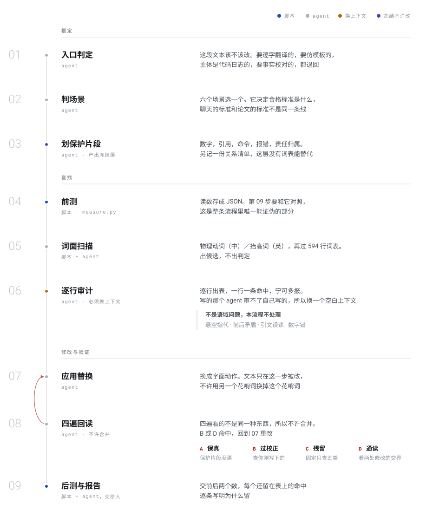

<div align="center">
  
</div>

<div align="center">

[中文（默认）](./README.md) | English

</div>
<br>

<div align="center">
  <picture>
    <source media="(prefers-color-scheme: dark)" srcset="assets/flow-dark.svg">
    
  </picture>
</div>

<br>

## The test

Model prose has a fixed set of defects. They can be listed, and they can be counted.

They all do the same job: they show the reader that the writer is clever. The vivid analogy does it,
the staged reversal does it, the short assertion at the end of a paragraph does it, and so does the
word picked because it sounds learned. Read line by line none of it looks wrong, which is exactly why
it survives editing. One question decides any sentence:

> Is this **saying the thing**, or **being clever**?

Plain, careful wording is not the defect. It is the target. Plain is also not colloquial, and editing
a document into conversation is the other way to get it wrong.

## Two layers

**Principle layer. Absolute, no scene exempts it.** Do not fabricate. Do not judge the person. Do not
change what a sentence claims. Do not rewrite quoted material. Do not fabricate voice.
**Do not build a metaphor.** The last one is written as an absolute because it is the one an editor
grants themselves an exemption for. Never explain A by swapping it for a B from another domain. The
test is on the reader's side: does the reader have to map A onto B to understand it? Three things sit
outside the rule:

- a name the field has frozen: *deadlock*, *idempotent*, *back-pressure*
- a dead metaphor the language absorbed: *support*, *framework*, *pipeline*, where the reader maps nothing
- a subject that genuinely is in that domain

**Expression layer. Elastic, with named caps.** Dashes · openers · signposts · announced actions ·
triads. The standard is "as few as the text can carry", not literal zero. Real people use a dash.

## The nine steps

The diagram above is the whole procedure. Fixed order, no skipping. Three things are worth saying
separately:

1. **Freeze before you touch anything.** Numbers, quotations, commands, error strings and attribution
   get marked, plus a separate record of relations: which number modifies which object, who did what,
   what is based on what. No word list can do this layer, and its damage is probably not recoverable
   from the finished text either, because the finished text no longer holds the relations. Of the
   layers listed here, that appears to be true of this one alone.
2. **Only step 06 must run in a fresh context.** Whatever wrote the text is a poor auditor of it,
   because it re-reads its own intent rather than the words on the page. In this repository's runs
   that has held for an agent as reliably as for a person. The rule is implemented as a hard requirement: the audit runs in a fresh-context subagent.
   A human enters the loop twice, to sign off the proposed-deletion list under `bounded` scope and to
   read the report.
3. **Four rereads, and they may not be merged.** They see different things. B checks the replacement
   text you just wrote yourself; D checks the junction between two edits, which the first three
   passes structurally cannot see because they work item by item.

## Which way this tool fails

Worth saying up front, because the pipeline causes it.

Readability is the goal, and **a condition of applicability is exactly what makes a sentence blunt**.
`in a clean-entry container`, `a single run`, `a smoke test`, `autonomously`. These look like any
other clause, and across the signatures tried so far none has separated them from ordinary prose, so
a pass that goes well is likely to remove them by preference. Compare:

> In one smoke run, in a clean-entry container, a fresh session adopted the workflow zero times on its own.
>
> An agent passed every check and never used the workflow.

The second reads better, and the register instincts in this repository mostly prefer it. It is also
a different claim, and no check further down this pipeline reports the difference, because what
remains is well formed and correctly attributed.

The fix is order, not care. **Qualifiers are frozen before the register work starts**, marked once by
whoever knows where the number came from, after which the tooling only has to leave them alone. That
is why D6 runs at step 02 rather than in the audit, and why it annotates instead of rewriting: the
information it needs is not in the text.

## Three tiers of indicator

An indicator earns a place in the counted set only if its hits are almost always real. When
measurement says otherwise it gets demoted, and the reason is printed in every report so nobody
quietly puts it back.

| tier | authority | contents |
|---|---|---|
| **GATED** | drive to zero, or name every survivor | em dash · staged reversal · `顿号` · mid-prose `：` · assistant residue · knowledge-cutoff disclaimer · emoji · `-ing` pseudo-analysis · copula dodge · false range |
| **CAPPED** | only the excess is a finding | signposts · editorial stance · lecture tone · exclamations · stacked hedges · mid-sentence bold · inline-title list · trailing contrastive tail |
| **REPORTED** | printed, never gates anything | sentence-length CV · conjunction density · nominalisation · metaphor fields · rule-of-three candidates · lexicon hits |

Five have been demoted on evidence. The first three came from earlier runs:

- **Rule of three.** The defect is real, the counter is not. On the first document scanned, all five
  hits were ordinary enumerations.
- **Conjunction density.** Calibrated on 95 passages and the criterion inverted. Text that should
  *not* change had a median of 5.26 per 1000 against 0.00 for text that should. A matched pair pins
  it: a narrative post at 80.00 needed half its connectives cut, a migration doc at 81.08 needed none.
- **Bolded assertion.** After the counter was fixed it turned out not to catch the real defect, and a
  bolded assertion is shape-identical to a bolded list label. Only meaning separates them.
- **The trailing contrastive tail** and **the inline-title list item**, both demoted when the gates
  were first run over this repository's own prose. Six hits against one, and eleven against none.
  "This repository runs it on itself" below has the detail.

Personification and metaphor are not counted either. A frozen name, a literal use and a live metaphor
look identical to a word list, so `--metaphor` lists candidates with line numbers and the decision is
made in the audit table.

## Use

```bash
python3 tools/measure.py FILE --scene academic      # measure before
python3 tools/measure.py FILE --metaphor            # borrowed-domain and physical-verb candidates
python3 tools/measure.py FILE --hits                # lexicon candidates
python3 tools/measure.py FILE --worksheet           # per-sentence audit worksheet
python3 tools/measure.py --diff before.json after.json
python3 evals/run.py                                # regression score for lexical detection
```

Install as a Claude Code skill by placing this repository at `~/.claude/skills/deslop`, or symlink it.

## A real run

`worked-example/` is a full pass over an academic draft. The input is frozen in `00-input.md`.

| indicator | before | after |
|---|---|---|
| em dash | 38 | **0** |
| staged reversal | 7 | 1 (exempt, named) |
| editorial stance | 7 | 2 (kept on purpose) |
| words of prose | 3462 | 3385 |
| sentences | 227 | 242 |

More sentences, fewer words. That is the signature of decompression rather than deletion: 38 clauses
hanging off a dash became sentences, appositions or parentheses.

The more useful part is the end of `02-audit.md`. Passes B and D reversed seven of my own decisions.
Two were over-corrections of mine, one of which removed a hedged self-assessment and so strengthened
a claim the author never made. Three were junction defects created by my own sentence splits, and
neither line-by-line pass saw any of them.

## What this version merged

deslop's own half was the test, compression punctuation, the burden-of-proof flip, before/after
indicators and the over-correction pass. This version merged three more projects in:

| project | what it brought |
|---|---|
| [说人话 / shuorenhua](https://github.com/MrGeDiao/shuorenhua) | the control surface: scene, protected spans, tier, level × scope, unsourced-citation modes, two-stage reread, annotation mode |
| [natural-talk](https://github.com/chengzhi-c/natural-talk) | the principle/expression split, numeric caps, and the best anti-overcorrection material of the four |
| [Humanizer-zh](https://github.com/op7418/Humanizer-zh) | the Wikipedia *Signs of AI writing* pattern set: significance inflation, `-ing` pseudo-analysis, copula avoidance, synonym cycling, false ranges, formatting tells |

Public complaint threads are a fifth source and not a fifth merge: they report what strangers
notice rather than a ruleset. What was usable, with a citation per claim, is in
[`references/field-reports.md`](./references/field-reports.md). What came in was mostly the comment
and interface-text family (`taxonomy.md` M) and one check this repository had never run on itself.
What was declined is the most popular design in that space, handing the text to a second model to
rewrite. The reason and its cost are in the same file.

They contradicted each other in several places. Every ruling and its reason is in
[`references/provenance.md`](./references/provenance.md). The two that mattered: **"inject soul"** was
split into deslop (removal, on by default) and re-voice (addition, off by default, needs material the
author actually holds); and **conjunction density** lost its global threshold to measurement.

## Files

| | |
|---|---|
| [`SKILL.md`](./SKILL.md) | the behavioural contract, nine fixed steps |
| [`references/taxonomy.md`](./references/taxonomy.md) | fourteen marker families, each attributed to the project it came from |
| [`references/decisions.md`](./references/decisions.md) | per-hit decision procedure, exemption caps, keep conditions, `in-place` alternates |
| [`references/overcorrection.md`](./references/overcorrection.md) | the false-positive corpus: what looks like a tell and is not |
| [`references/provenance.md`](./references/provenance.md) | what came from where, every conflict, and the ruling |
| [`references/field-reports.md`](./references/field-reports.md) | what the public complaint threads are worth, attributed line by line, and which parts changed the contract |
| [`references/code-comments.md`](./references/code-comments.md) | comments and interface text: who the reader is, and which step removes what |
| [`references/selfcheck.tsv`](./references/selfcheck.tsv) | this repository's own surviving gate hits, each with a reason |
| [`references/lexicon.tsv`](./references/lexicon.tsv) | 584 candidate rows, zh and en, each with replacement, note and source project |
| [`tools/measure.py`](./tools/measure.py) | indicators, lexicon scan, metaphor worklist, comment worklist, worksheet, before/after diff |
| [`tools/selfcheck.py`](./tools/selfcheck.py) | runs the gates on this repository's own prose |
| [`docs/pipeline.html`](./docs/pipeline.html) | the diagram and the step notes, one 28 KB page, no external files |
| [`worked-example/`](./worked-example/) | one complete run |

The lexicon is generated by `tools/build_lexicon.py` from the four upstream checkouts rather than
typed by hand. Dedupe is by match, not by string equality, or the same word would carry four rows
under four names.

The artwork behind the banner was generated by an image model, with a prompt that asked for no
letters at all; the type is set afterwards in real fonts. Image models garble letterforms, and
garbled letterforms on a repository about removing AI tells would be the loudest tell available. What
the artwork draws is lines of set type, dense and ornamented on the left, thinning to a few clean
rules on the right, which is the subject drawn as itself rather than as an analogy for itself. That
is the one exemption H6 grants. The composition script is
[`tools/make_banner.py`](./tools/make_banner.py) and the artwork is kept at `assets/banner-art.jpg`,
so the banner can be rebuilt. The strapline carries no number that can go stale.

## This repository runs it on itself

`python3 tools/selfcheck.py` runs the gates over the 15 files that speak in deslop's own voice.
Every GATED hit is either fixed or named in [`references/selfcheck.tsv`](./references/selfcheck.tsv)
with its reason. An unnamed hit fails the check, and so does a reason left behind after its hit is
gone, which is what stops the list turning into a blanket exemption.

The first run demoted two indicators. The trailing contrastive tail (`…, not a style call.`) had six
hits here and one was real. The inline-title list item had eleven and none was, because F4's rule
requires the body to restate the label and no regex can see that. A third pattern was found and
deliberately left alone: 17 of the 30 hit-level survivors say the same thing, that `、` was separating
list items rather than joining clauses. These files are marker inventories, the least representative
Chinese prose available, and demoting a gate on them would mean picking the sample most likely to
excuse it.

Zero em dashes across every file, which is measured. No live metaphor introduced by the author was
found, which is a read rather than a count, for the reason given above: a word list cannot separate
one from a frozen name.

`evals/run.py` scores lexical detection against 56 cases: 100% recall, with two known false
positives, both from deliberately broad rules (`你` in documents, `请求` under over-catching empathy).

## License

MIT
